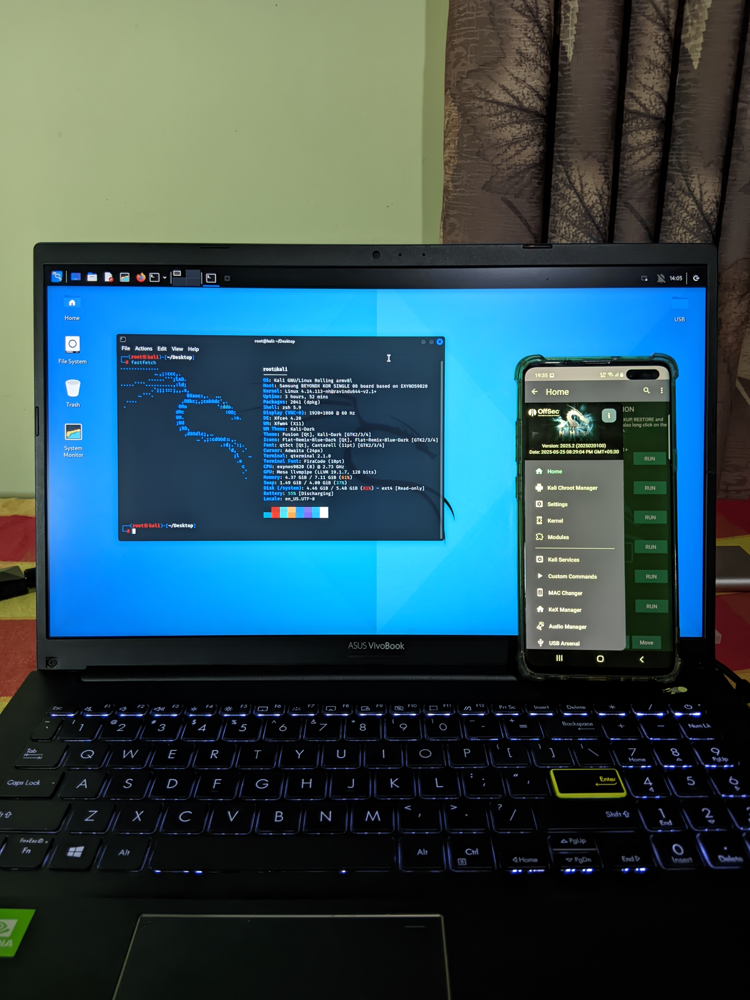
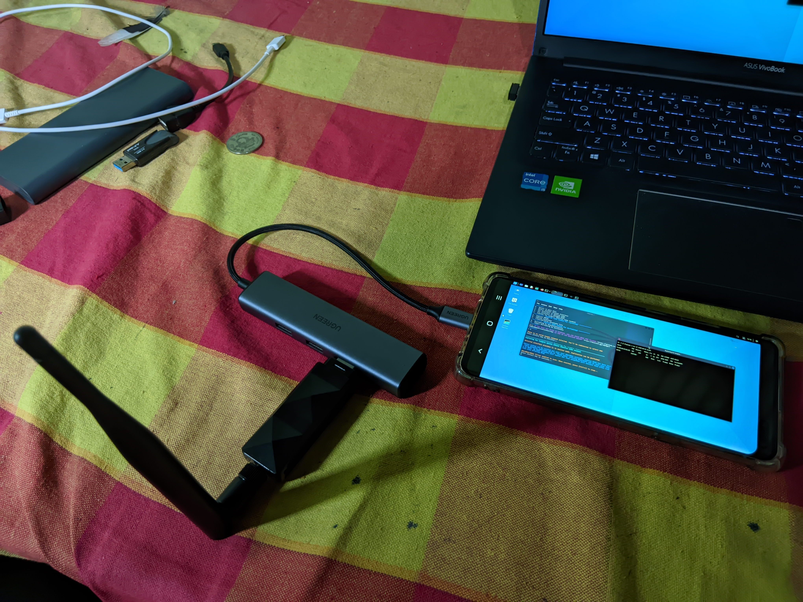
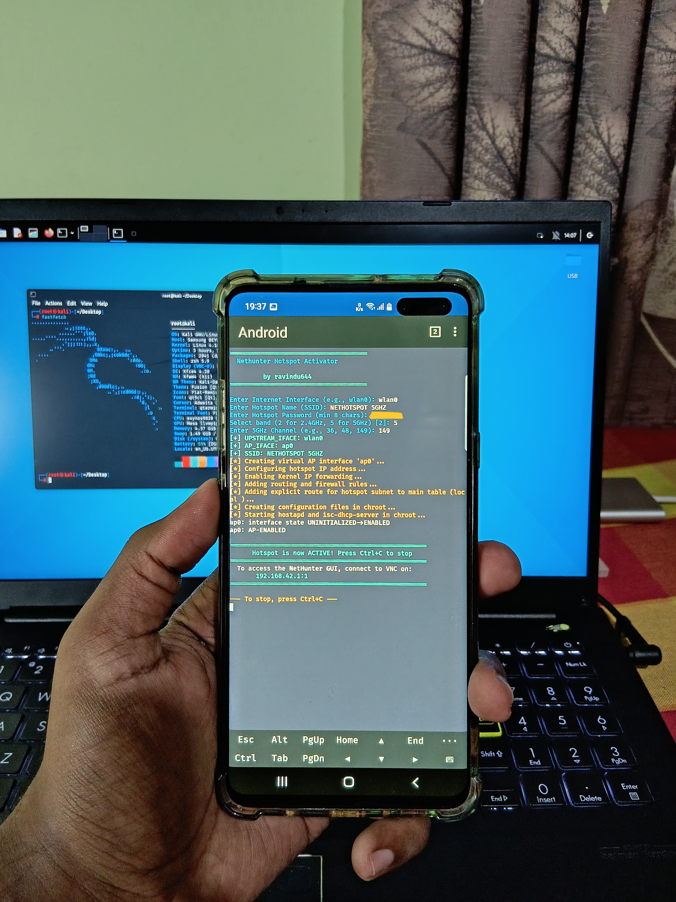
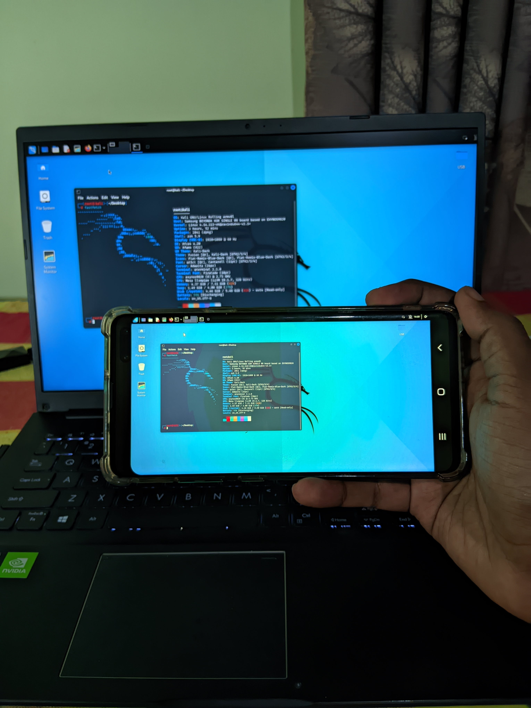
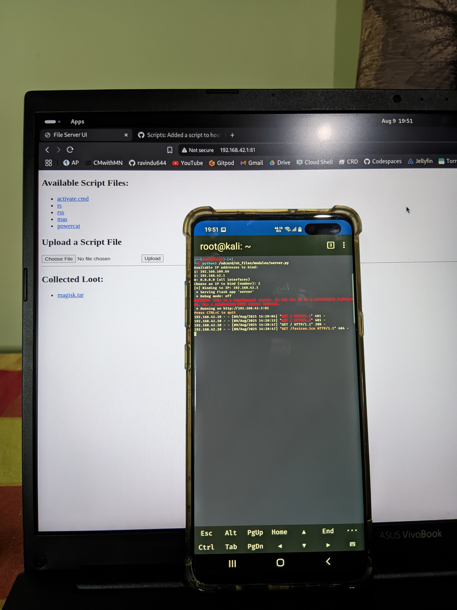
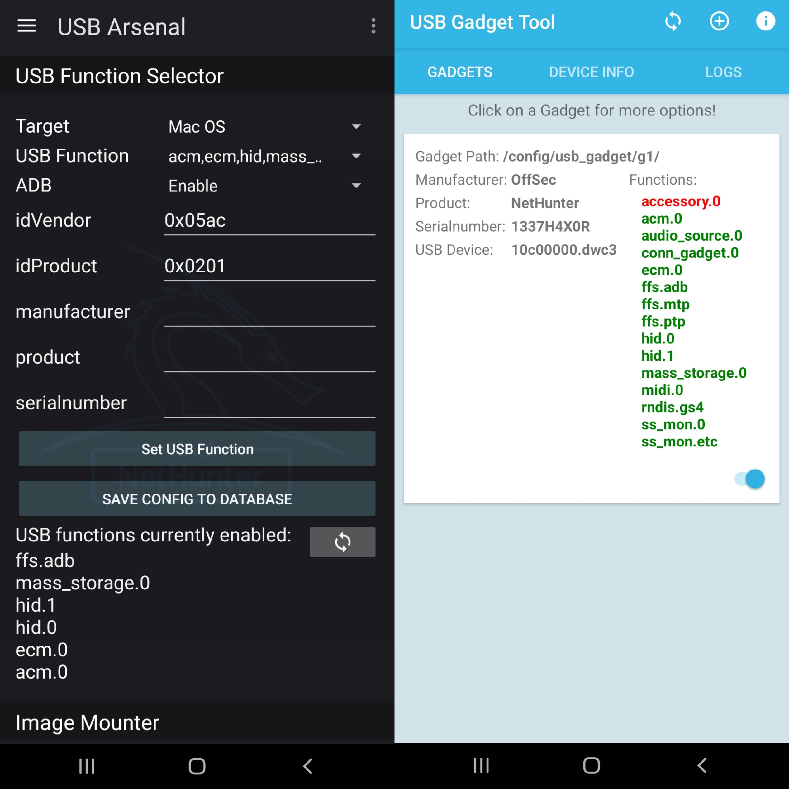
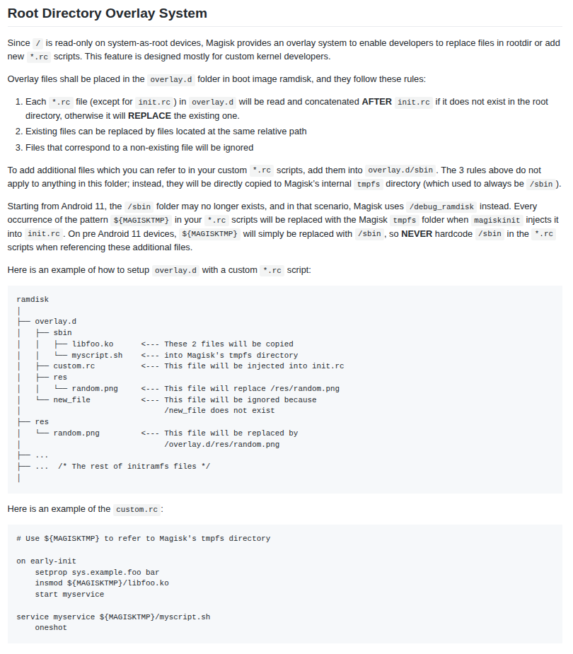
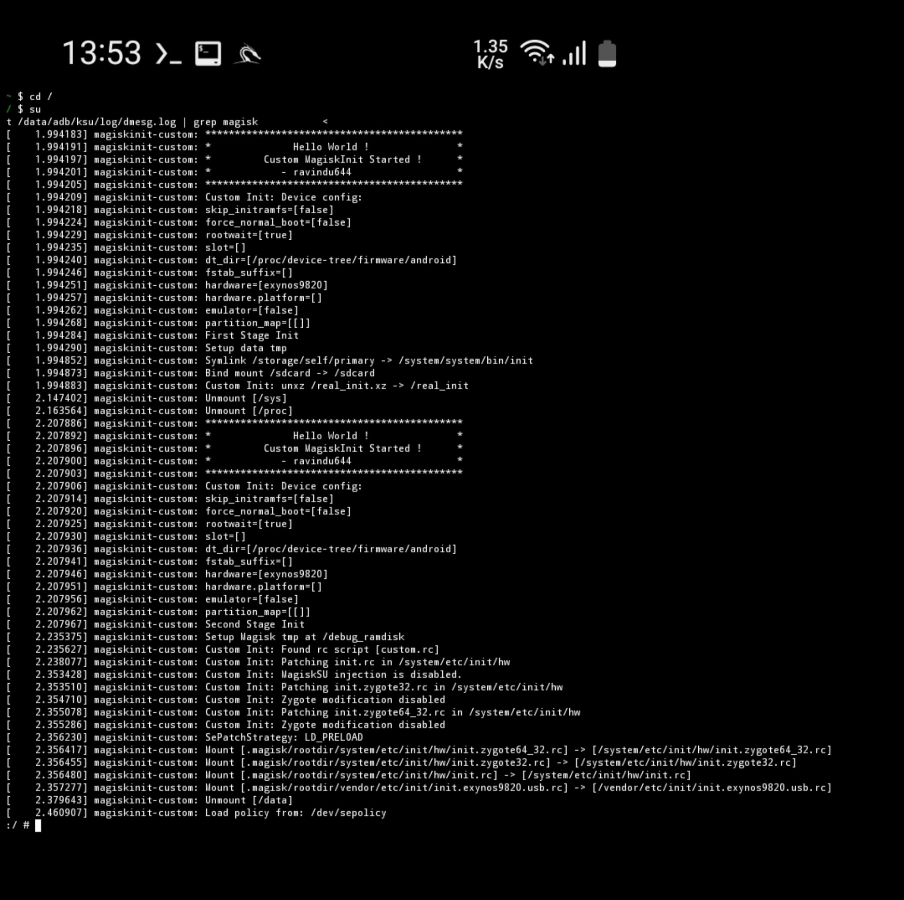

> [!CAUTION]
> This project is intended purely for educational and research purposes only.
The author is **not responsible** for any misuse, damage, or legal consequences arising from how you use this project.
>
> Use it responsibly and at your own risk.
>

---

# 🐉 Nethunter Kernel with a custom Nethunter APK for Galaxy S10 family !


[](#)
[](https://t.me/SamsungTweaks)


*Custom NetHunter environment running on Galaxy S10*

---

**Kernel Version:** 4.14.113  
**Based on:** Official Samsung Opensource kernel for S10  
**Supported Devices:** S10e, S10, S10+ and S10 5G on One UI 4.1 Stock ROM  
**Installation Method**: From `KernelSU-Next` manager.

---

**All parts of this project are 100% open source:**  
- [The Kernel](https://github.com/ravindu644/samsung_exynos9820_stock)  
- [The Magisk module with the modified NetHunter app](https://github.com/ravindu644/Nethunter_APK_KernelSU)  
- [Custom MagiskInit for `.rc` modifications](https://github.com/ravindu644/magiskinit-custom)  
- [Where I started (the initial commits of the USB Arsenal fix)](https://github.com/ravindu644/Simple-Android-Guides/commits/exynos9820-hid-ums/)  

---

## Quick Links

1. [🟠 Features](https://github.com/ravindu644/samsung_exynos9820_stock/tree/readme?tab=readme-ov-file#-features)

    - [Kernel](https://github.com/ravindu644/samsung_exynos9820_stock/tree/readme?tab=readme-ov-file#01-kernel)
    - [Custom NetHunter APK](https://github.com/ravindu644/samsung_exynos9820_stock/tree/readme?tab=readme-ov-file#02-custom-nethunter-apk)
    - [Magisk / KSU / AP Module](https://github.com/ravindu644/samsung_exynos9820_stock/tree/readme?tab=readme-ov-file#03-magisk--ksu--ap-module)

2. [🟢 Installation](https://github.com/ravindu644/samsung_exynos9820_stock/tree/readme?tab=readme-ov-file#-installation)
3. [🔴 Uninstallation](https://github.com/ravindu644/samsung_exynos9820_stock/tree/readme?tab=readme-ov-file#-uninstallation)
4. [⚙️ Behind the Scenes](https://github.com/ravindu644/samsung_exynos9820_stock/tree/readme?tab=readme-ov-file#%EF%B8%8F-behind-the-scenes)

---

# 🟠 Features

## 01. Kernel:
- **Pre-rooted with** `KernelSU-Next v1.0.9`  
    - Removed SuSFS support from the kernel because it caused conflicts with NetHunter’s mount system.

- **WireGuard** built-in kernel module.  

- **Full hardware support** in the Nethunter Chroot.

      
    *Nethunter GUI is scanning for nearby Wi-Fi networks using the adapter plugged in through the UGREEN HUB.*

- **Wireless:**  
    - [PATCH] Added `rtl8188eus` and `rtl88xxau` drivers.  
    - [PATCH] Wi-Fi injection support.  
    - Added support for all USB Wi-Fi adapters required by NetHunter.  
    - [NETHUNTER] Internal Wi-Fi now supports creating fake APs and ultra-fast 5GHz hotspots, with NAT and localhost routing for connecting to the NetHunter GUI and deploying scripts at blazing speeds.

- **Bluetooth:**  
    - Added support for all USB Bluetooth adapters required by NetHunter.  
    - [PATCH] Added quirks to fix `hciconfig` issues in “fake” CSR BT dongles.  
    - [NETHUNTER] Support for changing Bluetooth MAC, class, and name; injecting keystrokes; flood ping; RFCOMM scans, etc.

- **USB:**  
    - **[PATCH] Fixed Samsung’s poor USB ConfigFS implementation and added a method to patch the main init process, replacing the original `init.exynos9820.usb.rc` with a custom version **before** `init.rc` parsing starts — enabling full USB Arsenal support in NetHunter.** 
    - [NETHUNTER] Drivedroid, HID keyboard/mouse, RNDIS (tethering), mass storage — everything works!

- **File Systems:**  
    - Enabled various filesystems: OverlayFS, BTRFS, CIFS, SquashFS, UDF, CD file systems, etc. 
    - Enabled configs for network filesystem support.

## 02. Custom NetHunter APK

- **Specially optimized for Exynos 9820** devices to implement a brand new `USB Arsenal` logic *that actually works*  
  (More on this at the end of the README)  
  ([f406fbc](https://github.com/ravindu644/Nethunter_APK_KernelSU/commit/f406fbc39689c140930bf6d64b373c095fd843ed),  
  [a488e77](https://github.com/ravindu644/Nethunter_APK_KernelSU/commit/a488e77e175414eb45bdafc28fc0ba5e541d4746))

- **USB Spoofing:**  
  Changes Manufacturer, Product, and Serial Number to  
  `OffSec`, `NetHunter`, and `1337H4X0R` whenever an attack starts,  
  then reverts to original values when the attack ends or the "Reset" button is pressed in USB Arsenal.  
  ([faf0ee2](https://github.com/ravindu644/Nethunter_APK_KernelSU/commit/faf0ee23389e9dfa63af6cbae101417016510838),  
  [733a0e8](https://github.com/ravindu644/Nethunter_APK_KernelSU/commit/733a0e8242815841f7137e47631629c9762585b9))

- **Bug fixes:**  
  - Fixed `usbtethering` command not found. ([bc5b483](https://github.com/ravindu644/Nethunter_APK_KernelSU/commit/bc5b48393364e279eb783e561d85fda2d79fd162))  
  - Fixed DeAuth menu not detecting all Wi-Fi interfaces. ([e19ddae](https://github.com/ravindu644/Nethunter_APK_KernelSU/commit/e19ddaef6b71249d0860bda9cdad59ea7021dc56))  
  - Fixed WiFiPumpkin not changing MAC address. ([3e8fc42](https://github.com/ravindu644/Nethunter_APK_KernelSU/commit/3e8fc4278062d6befaca990eca7c124aed8c2da6))  
  - Fixed WiFiPumpkin3 captive portal forwarding rules using `socat`. ([4f91b6f](https://github.com/ravindu644/Nethunter_APK_KernelSU/commit/4f91b6f998a5261edb31a27b5a1efdfcc815f75a))

- **Improvements:**  
  - Enhanced chroot booting logic. ([bcd4507](https://github.com/ravindu644/Nethunter_APK_KernelSU/commit/bcd4507a3be96bb791b0a67fd45b4e6ba4104eec),  
    [9a854c1](https://github.com/ravindu644/Nethunter_APK_KernelSU/commit/9a854c1d7268566c9678c4d2f0ab738fddd3e9a2))  

- **New features:**  
  - Added custom commands, including a 5 GHz hotspot starter. ([197a2ef](https://github.com/ravindu644/Nethunter_APK_KernelSU/commit/197a2eff405d6de1c498972616d4e6f5877d8f31))  

      
    *This 5GHz hotspot is very useful when using the KeX feature **wirelessly** at near zero latency*

      
    *Wireless KeX*    


  - Added a file server script to host and upload scripts/content. ([12e9682](https://github.com/ravindu644/Nethunter_APK_KernelSU/commit/12e968275e9df4774282920b7e0795ef50072bfc))  

      
    *HTTP Server for download/upload scripts :)*    

  - Added more DuckyScripts and fixed existing ones.

## 03. Magisk / KSU / AP Module

- **Automatic device capability verification** – checks if the device supports required features before proceeding.
- **Boot & DTBO backup** – automatically backs up stock `boot` and `dtbo` images to `/sdcard/BootBackup` before flashing the kernel.
- **Module-based kernel flashing** – eliminates the need for manual flashing.
- **Wi-Fi firmware installation** – installs all firmware required for NetHunter’s wireless functions.
- **ConfigFS integration** – installs `keyboard` and `mouse` report descriptors to sync with the new ConfigFS logic.

---

# 🟢 Installation

01. **First, download NetHunter for KSU from here**  

    - https://github.com/SherlockChiang/Nethunter_for_KernelSU
    - [Download the latest rootfs from here](https://kali.download/nethunter-images/current/rootfs/) (full rootfs is recommended)
    - Unzip the `Nethunter_for_KernelSU` zip, replace its `kali-nethunter-rootfs-xxxx.xz` file with the downloaded latest one.
    - Zip it again and flash it via KSU Manager → reboot the phone once.
    - Then, don't do anything, and follow step `02` below.

02. Download the `Module.zip` from the GitHub releases.  
03. Install it via KSU Manager, copy the created `BootBackup` to your PC, and reboot the phone.

    - This process will uninstall the original NetHunter APK and replace it with our custom one.

---

# 🔴 Uninstallation


- Remove the `Kali chroot` from the "Nethunter" App's `Kali Chroot Manager`.
- Remove the `Nethunter` KSU modules we've installed.
- Restore the `BootBackup`.
- Done !

---

# ⚙️ Behind the Scenes 

### 01. Introduction - The Challenges.

- Building the NetHunter Kernel was an easy task for me, as a regular kernel cooker, but even though I did everything correctly, I never got the HID features working on my S10—not on the S10, nor on almost **any Exynos device** I have ever tested.  

- Since I got a new phone, I unpacked its vendor partition and took a look at how that device handles ConfigFS for creating USB functions like HID, Mass Storage, etc., and I saw a huge difference between **Exynos's init.usb.exynos9820.rc** and my **Mediatek's init.usb.mt6835.rc** file.  

- In brief, the Exynos rc file had only about 500 lines of code, while the Mediatek one had over 1,100.  

- After that, I realized that even though Samsung's ConfigFS functions "just work" for their stock ROM, it's not a standard implementation of creating the functions properly.  

- What I did was simply replace my Exynos rc file’s contents with the Mediatek version, then repack the vendor.img and flash it to see what would happen—and it seems to be working!  

- I was able to create an HID gadget, but it’s half-broken and never actually worked.

### 02. How I Fixed "The Challenges"  
- Well, this is one of the hardest things I’ve ever done in my life.
- After analyzing Mediatek’s **init.usb.mtxxxx.rc** code, I decided, “I’m going to write my own rc file”
- I took the logic from the Mediatek RC file (how it works, how it creates new functions, and how it swaps between functions in real time).
- Then, I wrote the [basic function creation on `post-fs`](https://github.com/ravindu644/Simple-Android-Guides/commit/b3c49d92d94aaadb0523c9b698fa23dfc6ad8ea0), and [created the barebones structure for what the system should do when the `sys.usb.config` value becomes HID](https://github.com/ravindu644/Simple-Android-Guides/commit/3755533f83c3cc2655633027d9732626581192f0), and then [what to do in HID+ADB situations, and so on](https://github.com/ravindu644/Simple-Android-Guides/commit/3755533f83c3cc2655633027d9732626581192f0).
- Then, I repeated this entire process to create all the composite functions needed for NetHunter’s USB arsenal.

    - For example: HID, HID+ADB, Mass Storage, Mass Storage+ADB, RNDIS, RNDIS+ADB, HID+Mass Storage, HID+Mass Storage+ADB, RNDIS+HID, RNDIS+HID+ADB, RNDIS+Mass Storage+HID, RNDIS+Mass Storage+HID+ADB, and the same for Apple’s ECM and ACM.
    - **This was a nightmare for me.**
    - The final result was an `.rc` file with a whopping 2,500+ lines of code!

- After that, I placed my custom `init.exynos9820.usb.rc` file in the correct location inside the `vendor` image, cooked it, then flashed it—and everything looked normal.

[You can inspect this whole drama from here.](https://github.com/ravindu644/Simple-Android-Guides/commits/exynos9820-hid-ums/)

### 03. How I Got More Problems...  
- Even though I succeeded, the userspace NetHunter app was not able to create any functions and instantly failed.  
- This is when I decided, **"Let’s decompile the APK and see what’s actually happening."**  
- In the original USB Arsenal code, I saw that it **manually deletes available functions**, **creates new ones**, and **symlinks them to bring them “up.”**  
- For some odd reason, Exynos’s `/config` folder becomes read-only, where even the `root` user can’t create new folders or anything new—only **write to existing files**.  
- But interestingly, when I type `setprop sys.usb.config hid`, the system immediately nukes existing functions, creates only the "hid" function, and links it up!  
- Because, in our new `init.exynos9820.usb.rc` file, we defined that when the value for the property `setprop sys.usb.config` becomes `hid`, execute these "stuffs":

    ```rc
    on property:sys.usb.config=nethunter,hid
        setprop vendor.usb.state ${sys.usb.config}

        write /config/usb_gadget/g1/configs/b.1/strings/0x409/configuration "hid"
        write /config/usb_gadget/g1/idProduct ${offsec.nethunter.idProduct}
        write /config/usb_gadget/g1/idVendor ${offsec.nethunter.idVendor}
        write /config/usb_gadget/g1/os_desc/use 1
        write /sys/class/udc/${vendor.usb.controller}/device/saving 1

        # NUKE STEP: Delete any pre-existing function links to ensure a clean slate.
        rm /config/usb_gadget/g1/configs/b.1/ffs.adb
        rm /config/usb_gadget/g1/configs/b.1/ss_mon.0
        rm /config/usb_gadget/g1/configs/b.1/hid.0
        rm /config/usb_gadget/g1/configs/b.1/hid.1
        rm /config/usb_gadget/g1/configs/b.1/mass_storage.0
        rm /config/usb_gadget/g1/configs/b.1/rndis.gs4
        rm /config/usb_gadget/g1/configs/b.1/ffs.mtp
        rm /config/usb_gadget/g1/configs/b.1/ss_mon.mtp
        rm /config/usb_gadget/g1/configs/b.1/acm.0
        rm /config/usb_gadget/g1/configs/b.1/ss_mon.0
        rm /config/usb_gadget/g1/configs/b.1/ffs.ptp
        rm /config/usb_gadget/g1/configs/b.1/conn_gadget.0
        rm /config/usb_gadget/g1/configs/b.1/ecm.0 

        # Configure HID Keyboard function
        write /config/usb_gadget/g1/functions/hid.0/protocol 1
        write /config/usb_gadget/g1/functions/hid.0/report_length 8
        write /config/usb_gadget/g1/functions/hid.0/subclass 1
        copy /vendor/firmware/hid/keyboard-descriptor.bin /config/usb_gadget/g1/functions/hid.0/report_desc

        # Configure HID Mouse function
        write /config/usb_gadget/g1/functions/hid.1/protocol 2
        write /config/usb_gadget/g1/functions/hid.1/report_length 4
        write /config/usb_gadget/g1/functions/hid.1/subclass 1
        copy /vendor/firmware/hid/mouse-descriptor.bin /config/usb_gadget/g1/functions/hid.1/report_desc
        
        # Enabling part
        symlink /config/usb_gadget/g1/functions/hid.0 /config/usb_gadget/g1/configs/b.1/hid.0
        symlink /config/usb_gadget/g1/functions/hid.1 /config/usb_gadget/g1/configs/b.1/hid.1

        # Syncing path
        symlink /config/usb_gadget/g1/configs/b.1 /config/usb_gadget/g1/os_desc/b.1

        write /config/usb_gadget/g1/UDC ${vendor.usb.controller}
        setprop sys.usb.state ${sys.usb.config}
    ```

- That means our 2,500+ lines of code are actually working.  
- It also means only `init` or `system` have the true access to create new entries in `/config`.

### 04. "The Fix"
- After realizing this situation, I immediately rewrote the logic of NetHunter’s `usbarsenal` script.  
- What I did was replace the entire function creation/writing/deleting part with a simple `setprop` command.  
- Commits: https://github.com/ravindu644/Nethunter_APK_KernelSU/commit/f406fbc39689c140930bf6d64b373c095fd843ed, https://github.com/ravindu644/Nethunter_APK_KernelSU/commit/a488e77e175414eb45bdafc28fc0ba5e541d4746, https://github.com/ravindu644/Nethunter_APK_KernelSU/commit/40b2b78f0249042b64b5b0ee391f0595c7cd9f53
- Now, when I tell the NetHunter app to "Create HID+RNDIS" functions, instead of running complex lines of code, the modified script just runs `setprop sys.usb.config nethunter,hid,rndis`.  
- When the NetHunter app sets that property, the init system triggers immediately and runs what we defined in our custom `.rc` script - like magic!

- After all this chaos, I can enable up to 5 functions without breaking a sweat in the NetHunter app.

    - For example: `acm,ecm,hid,mass_storage,adb`

      
    *Why not, I was able to spoof the Manufacturer, Product, and the SN too!*

### 05. The "Final Boss of the Challenge"
- Okay, everything is fully functional: I edited the NetHunter APK to implement our `setprop` changes and placed the `.rc` file inside the vendor.  
- But the issue is, I can't distribute a "universal vendor image"!  
- Either I have to write an on-device image unpacker to dump the block device as an `.img`, extract it, insert our modified `.rc` file, cook it, and flash it—a highly dangerous and impractical task.  
- You might say, "Just make a Magisk module to replace that file, bro," but it’s impossible.  
- Because Magisk/KSU overlays the module’s files **after** init has parsed all the `.rc` files.  
- The Magisk module method replaces the file **after** the init process reads it, which is useless and breaks our last hope :/

### 06. "The Definitive Master Plan"
- Okay, we need to somehow place our custom `.rc` file before even the main init process starts.  
- After digging through GitHub and Reddit, I found that Magisk offers something close to this, and I thought this is a good opportunity to try it out.  
- In Magisk's official documentation, they said:

      
    *This is what we were looking for!*

- **But,** I don't want MagiskSU, because I already have KernelSU. I don’t prefer a specific rooting method, but in this case, the latest Magisk is heavily unstable in NetHunter..!  
- This is where my "nerdy ideas" come in..!  
- What if we "nuke" the code where Magisk injects itself into the init process, while keeping the custom `.rc` parsing and overlaying functional?  
- This is where my new project [magiskinit-custom](https://github.com/ravindu644/magiskinit-custom) comes in!  
- But the problem is, to use `magiskinit`, **we must have a ramdisk inside our boot.img**. Yeah, we know, in the S10, there’s no such thing as a "ramdisk."  
- [So, I wired a ramdisk up on the kernel side xD](https://github.com/ravindu644/samsung_exynos9820_stock/commit/9f0622f8129ed5acbbf66aecf1d6bc8f3753f675)
- Then, I did exactly what was on my mind: removed the MagiskSU injection but kept the rest of the code untouched — and it worked!  

    **Final result:** Fully functional overlay system that replaces files before the main init.rc parses..!  

      
    *dmesg log of my magiskinit-custom injecting the main init.rc file, placing our custom init.exynos9820.usb.rc file*
